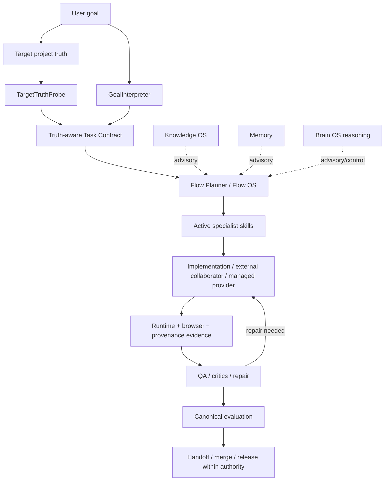

# UIUX AI Workspace

[](https://github.com/Ngh1aa/uiux-ai-workspace/actions/workflows/uiux-factory-ci.yml)
[](https://github.com/Ngh1aa/uiux-ai-workspace/actions/workflows/a20-release-candidate.yml)

**UIUX Factory** is a design-engineering operating system for moving a product goal from **project truth → research/design decisions → implementation → rendered verification → repair → handoff/release** without treating model self-report as evidence.

It is built for AI-assisted product/UI/UX work where the agent must remain grounded in the target repository, explicit authority, inspectable evidence and repeatable verification.

## What this repository does

- converts natural-language tasks into a typed Task Contract;
- probes target-project truth before Flow resolution;
- routes work through declarative UI/UX Flows and specialist skills;
- keeps reasoning/memory/knowledge advisory rather than authoritative;
- separates generated output from trusted runtime/browser evidence;
- supports external collaborators such as ChatGPT, Codex, Claude and GitHub-connected agents;
- verifies changes through GitHub Actions, browser/a11y/performance tooling and release-candidate regression;
- preserves intentional architecture holds instead of manufacturing PASS states.

## Current status

The A50–A55 architecture-upgrade sequence is closed with explicit intentional holds rather than hidden unfinished work.

Post-closure hardening currently includes:

- **P0 — target-truth-aware routing:** checked-out project truth participates in Task Contract routing before Flow resolution;
- **P1 — protected `main`:** server-side GitHub rules require a pull request, `foundation`, `release-candidate`, an up-to-date branch, and block deletion/force-pushes;
- public-facing evidence language distinguishes scenario-based expert walkthroughs from real participant research.

CI green means the relevant automated contracts/regressions passed. It does **not** by itself prove visual quality, real-user preference, product impact, accessibility of an untested target, or release readiness outside the evidence actually collected.

## Architecture at a glance



Canonical executable Flow OS owner:

```text
uiux-factory/core/runtime/flow_os/
```

The managed CLI uses that same canonical Flow OS and is **not a second Flow OS**.

## Start here

For a human or external AI collaborator, read **`START-HERE.md` first**. Do not preload the entire repository.

Normative ownership is defined in `docs/CONTRACT-OWNERSHIP.md`:

- `AGENTS.md` — universal operating/evidence contract;
- `skills_UIUX/runtime/runtime-policy.json` — authority, tools, sandbox, provider and release policy;
- `uiux-factory/core/runtime/flow_os/task_context.py` — natural-language Task Contract;
- `uiux-factory/core/runtime/flow_os/target_truth.py` — bounded target-project routing truth;
- `skills_UIUX/flows/*.json` + canonical Flow OS runtime — stage/skill/gate/replanning decisions;
- `skills_UIUX/<skill>/SKILL.md` — specialist capability knowledge;
- target-project source/runtime/tests — project truth and acceptance evidence.

Current architecture truth lives in:

```text
uiux-factory/docs/architecture/README.md
uiux-factory/docs/architecture/CURRENT-RUNTIME-MAP.md
```

Historical planning material lives under `docs/history/` and is never current architecture truth.

## Evidence model

The workspace keeps evidence classes separate on purpose:

```text
Generated output
    ≠ verified implementation

Model/provider claims
    ≠ trusted runtime evidence

Scenario-based expert walkthroughs
    ≠ human participant research

Lifecycle completion
    ≠ release approval

CI green
    ≠ product quality by itself
```

Trusted current-run evidence is owned by the runtime/provenance/QA surfaces. Terminal evaluation is owned by `core/evaluation/run_evaluator.py`.

When real-user evidence is unavailable, the default fallback for portfolio work is **5 scenario-based expert walkthroughs** / **5 simulated usage scenarios**. These may support prioritization and iteration, but they are not participant counts, human quotes, observed human task success or production impact.

See `AGENTS.md` for the full evidence and validation contract.

## One-command external collaborator mode

Use this when ChatGPT, Codex, Claude, another cloud model, or a GitHub-connected agent will perform target-repository work instead of an internal Factory provider:

```bash
python -B skills_UIUX/scripts/prepare-external-task.py \
  --repository owner/repo \
  --task "Redesign the portfolio toward Product Designer and make AI workflow evidence inspectable" \
  --authority branch_write \
  --qa-route / \
  --target-root /path/to/checked-out-project \
  --output external-task-manifest.json
```

The command compiles the task into:

- target-truth provenance;
- Task Contract + effective authority;
- resolved Flow;
- ordered stages;
- active skills and exact `SKILL.md` paths;
- gate-derived acceptance criteria;
- optional QA routes;
- research packet when evidence-led validation is required;
- explicit evidence/claim boundaries.

Routing precedence is bounded as:

```text
explicit caller override
> structured target-project truth
> natural-language goal inference
```

Target project files cannot grant merge/deploy/release authority or fabricate PASS evidence.

The initial manifest status is always `READY_FOR_EXTERNAL_COLLABORATOR`. A generated manifest never means implementation or QA passed.

## Managed Flow OS CLI

For local/provider-managed execution from the repository root:

```bash
python -B skills_UIUX/scripts/uiux-agent.py \
  --project ../my-site \
  --managed \
  --task "Redesign a B2B fintech settlement product" \
  --authority branch_write
```

Explicit project-truth overrides remain available when inference should not decide:

```bash
python -B skills_UIUX/scripts/uiux-agent.py \
  --project ../my-site \
  --managed \
  --task "Redesign the product" \
  --website-type saas \
  --domain financial-services \
  --product-archetype payments-infrastructure \
  --validation-lane production-learning \
  --mode production-candidate \
  --authority branch_write
```

See `skills_UIUX/FLOW-AGENT-OS.md` for lifecycle, provider, approval and replanning commands.

## Core repository surfaces

```text
uiux-factory/                         canonical runtime, evaluators and QA
skills_UIUX/                          declarative skills, flows, policy and knowledge
uiux-factory/core/runtime/flow_os/    shared executable Flow OS
uiux-factory/core/brain_os/           bounded reasoning/control layer
uiux-factory/core/evaluation/         canonical terminal evaluation
uiux-factory/qa/                      browser/a11y/performance/media evidence
.github/workflows/                    repeatable CI, dogfood and release-candidate checks
docs/                                 operating/evidence documentation
docs/history/                         superseded planning/history only
upstream/anthropics/                  pinned reference repositories
MetaGPT/                              vendored framework source
```

Reference/vendor source is not runtime authority unless intentionally adapted.

## Verification layers

### Foundation

`UIUX Factory CI` validates active architecture/routing/evidence contracts and the Python test suite.

### Release candidate

A20 runs full regression/security/dogfood and cross-project checks over pinned representative projects including Nova, Lumen, CENNEXT and LuxRoom.

### Target/browser evidence

When visual/runtime claims matter, use the Cloud QA toolchain or equivalent target browser evidence. Fixture smoke tests never prove another project passed QA.

### Human/product evidence

Real participant research, production analytics and product outcomes remain separate evidence classes. They cannot be synthesized from model output, scenarios or generic dogfood.

## Cloud QA

`Cloud QA Toolchain` audits the website that actually changed. For `workflow_dispatch`, provide the target repository/ref/root, routes and optional install/build/serve commands.

The workflow:

1. checks out the declared target in isolation;
2. runs declared install/build steps;
3. starts the preview server;
4. waits for target routes;
5. runs Playwright + axe on declared routes;
6. runs Lighthouse against declared target URLs;
7. uploads QA artifacts.

The internal `/fixture/` is only a toolchain smoke test.

For local/manual target harness:

```bash
cd uiux-factory/qa
QA_TARGET_DIR=/absolute/path/to/project \
QA_ROUTES=/,/about.html,/contact.html \
QA_INSTALL_COMMAND='npm ci' \
QA_BUILD_COMMAND='npm run build' \
QA_SERVE_COMMAND='npm run preview -- --host 0.0.0.0 --port 4173' \
node scripts/serve-target.mjs
```

## Local development

From `uiux-factory/`:

```bash
python -m pip install -r requirements-metagpt-core.txt
python -m pip install -r requirements-dev.txt
python -m pytest -q tests
```

Provider-backed direct pipeline work remains available when an approved provider is configured:

```bash
python run.py "Design a distinctive ecommerce website" --engine ai --runtime-preset visual-first
```

## Repository governance

The protected default branch requires:

```text
pull request
+ foundation
+ release-candidate
+ branch up to date
```

The active repository ruleset also blocks default-branch deletion and non-fast-forward/force-push updates, with no routine bypass actor.

This server-side configuration is owned by GitHub repository settings; the repository text describes it but does not replace that enforcement.

## Intentional holds

These are explicit non-blocking architecture/governance holds, not hidden PASS states:

- provider-default migration still requires the real live-provider evidence matrix;
- lifecycle mutation convergence remains separate while semantic blockers exist;
- GenAI/NIST expansion waits for the official framework-status trigger;
- vector/semantic retrieval remains optional until product need + benchmark evidence justify it;
- compatibility-shim removal requires a fresh external/downstream audit no earlier than the governed review boundary.

See `uiux-factory/docs/architecture/CURRENT-RUNTIME-MAP.md` for current details.

## Historical documents

Superseded plans are preserved under:

```text
docs/history/
```

They are useful for audit/history, but must not be used as current architecture/provider truth.

## Licensing

This public repository currently has **no declared software license**. Do not assume reuse/redistribution rights from repository visibility alone. A license should be selected explicitly by the repository owner before presenting the project as generally reusable open source.

## Capability upgrades

See `uiux-factory/docs/AI-CAPABILITY-UPGRADE-SOURCES.md` for optional future improvements to model routing, vision review, browser observation and evaluation depth.
