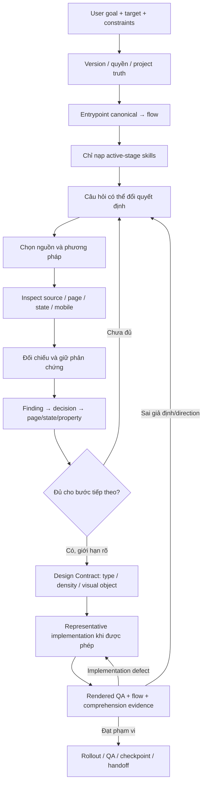

# Research trước thiết kế: flow làm việc với Factory

Ngày: 2026-10-09. Owner phương pháp: product-discovery / design-reference-research-and-benchmark / research-synthesis-and-insight-management. Packet owner: core/skills/research_workflow.py. Authority, source order và completion vẫn thuộc AGENTS/runtime/flow owners.

## Khi nào kích hoạt?

- Yêu cầu rõ “nghiên cứu trước khi thiết kế”, “research before design”, hoặc nghiên cứu buyers/website references: GoalInterpreter thêm `pre-design-research` từ phần yêu cầu không bị phủ định.
- Caller cũng có thể khai báo `--feature pre-design-research`.
- Research-only resolve `audit-review`, stage research → qa, authority read_only.
- Build/redesign resolve flow của nó. Stage research có benchmark nên nhận research_workflow; các stage còn lại không tải tài nguyên research mặc định.
- Audit API/console/keyboard nhỏ không tự nhận bộ pre-design research.

```bash
python -B skills_UIUX/scripts/prepare-external-task.py \
  --repository owner/project \
  --target-root /path/to/project \
  --task "Research buyers and website references before designing the website" \
  --authority read_only --intent research \
  --feature pre-design-research --output /authorized/artifacts/research-manifest.json
```

Thay owner/project và target-root bằng checkout thật. Không ghi artifact vào target chỉ vì packet có đường dẫn mẫu. Task cần quyền ghi local có packet riêng, không ghép research-only và build thành task khiến toàn bộ bị khóa read_only.

## Flow và artifact cần đọc



`research_workflow` là hợp đồng nạp tài nguyên/handoff, không là bằng chứng nghiên cứu hoàn tất. External collaborator đọc resources theo quyết định. Managed provider nhận resources **chỉ của skill đã active**, cùng budget với skill/source documents; conditional skills có thể cần `activate_skill_context` trước lượt tiếp theo. Bị vượt budget thì báo lỗi, không silently bỏ tài nguyên.

| Quyết định | Tài nguyên owner | Bàn giao |
|---|---|---|
| Người mua/người dùng, câu hỏi, cách học | [Decision-led research](../skills_UIUX/product-discovery/references/decision-led-research.md) | Brief, assumption/question → decision IDs |
| Reference theo ngành/page role | [Anatomy method](../skills_UIUX/design-reference-research-and-benchmark/references/reference-anatomy-method.md) | Page/state/source + ADOPT/ADAPT/REJECT + mobile caveat |
| Diễn giải và response thiết kế | [Evidence to design](../skills_UIUX/research-synthesis-and-insight-management/references/evidence-to-design.md) | Findings, evidence và decision log hiện có |
| Khác biệt direction và comparison | visual-design-direction / design_decisions / design_comparison hiện có | source.ref, reference transfer, numeric roles, capture-bound review |

## Hai loại research, hai giới hạn

Desk research đã đọc/inspect là DESK_EVIDENCE, có thể có findings dù không có participants. Nó có source, ngày, context và limitations. Hypothesis thiết kế không nâng thành user finding.

`research_packet` dành cho human/evidence-led vẫn giữ templates và state cũ. Không có participants thì human sessions/results vắng mặt, validation PLANNED/BLOCKED/UNKNOWN; ledger chỉ trống nếu chưa thu bất kỳ evidence thật nào. Không bịa task success, quotes, counts hoặc preference.

Schema ledger không thay đổi. Manifest 1.3 bổ sung trường stage.research_workflow; các trường cũ và Design Contract 1.0/2.0 giữ nguyên. Compatibility này được kiểm regression; không tương đương một production release hay human validation.

## Ví dụ và điều kiện dừng

Đọc [bốn worked examples](../skills_UIUX/design-reference-research-and-benchmark/examples/research-to-design-cases.md) khi cần học cách chuyển nguyên tắc. Đây là synthetic fixtures; không dùng làm domain evidence cho khách hàng thật.

Dừng một vòng research khi quyết định tiếp theo có cơ sở phù hợp rủi ro và UNKNOWN có cách kiểm. Nếu chỉ có câu “hierarchy rõ”, hỏi thuộc tính nào trên page/state nào thay đổi. Nếu không trả lời được, chưa đủ handoff.

## Checkpoint

Mỗi checkpoint ghi source/version, files/resources thực sự đọc, decision bị ảnh hưởng, evidence/gates, UNKNOWN và next action. Routing đúng, JSON hợp lệ và đủ tài liệu không chứng minh giao diện đẹp hơn. Xem report local được bàn giao cùng task để biết phạm vi test thực tế. Git publication luôn cần quyền riêng.
