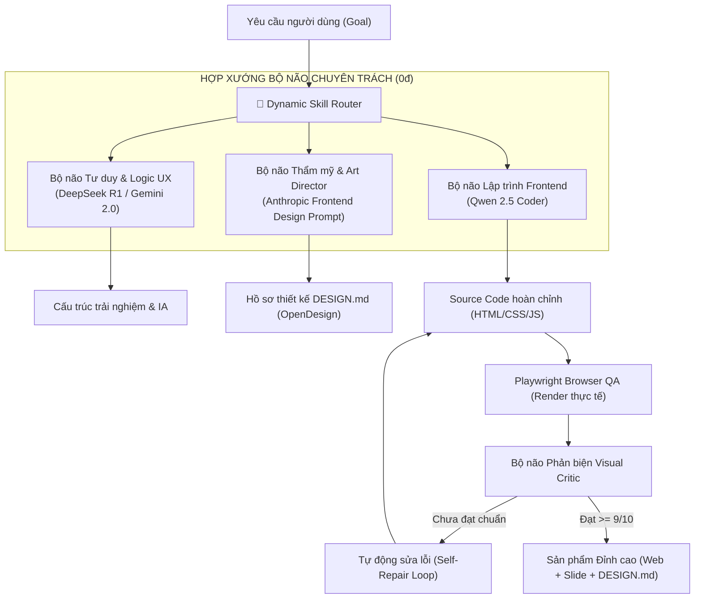

# Kế hoạch Triển khai: Chi phí 0đ & Nâng cấp "Bộ não" Hệ thống UI/UX

Kế hoạch chi tiết nhằm **đảm bảo 100% chi phí 0 đồng** (sử dụng hoàn toàn mã nguồn mở, Local LLM và Cloud Free-Tier hợp pháp) kết hợp với giải pháp **nâng cấp "Bộ não" (Brain & Multi-Agent Intelligence)** để tạo ra các trang web có thẩm mỹ và chất lượng kỹ thuật vượt trội.

---

## 1. Cam kết Giải pháp Chi phí 0 Đồng (Zero-Cost Guarantee)

Toàn bộ hệ thống sẽ được cấu hình để vận hành mà không cần thẻ tín dụng hay chi phí API:

| Giải pháp | Nguồn cung cấp | Model sử dụng | Chi phí | Ưu điểm |
| :--- | :--- | :--- | :---: | :--- |
|

---

## 2. Kiến trúc Nâng cấp "Bộ não" (Brain & Model Architecture)

Để sản phẩm đầu ra đạt mức "đẹp nhất và hoàn chỉnh nhất", chúng ta nâng cấp cơ chế tư duy của hệ thống từ mô hình đơn lẻ sang **Liên minh Đa Tác tử Chuyên trách (Specialized Multi-Brain Consortium)**:

### Các trụ cột nâng cấp trí tuệ nhân tạo:
1. **Phân vai theo thế mạnh tuyệt đối**:
   - **Tư duy chiến lược & Phản biện lỗi**: Giao cho `DeepSeek R1` (khả năng Chain-of-Thought suy luận sâu).
   - **Định hướng thẩm mỹ & Phong cách**: Giao cho `Anthropic Frontend Design Engine` (bộ quy tắc khắt khe về Typography, White-space, Palette).
   - **Thực thi code frontend**: Giao cho `Qwen 2.5 Coder` (chuyên gia hàng đầu về code UI không lỗi).
2. **Vòng lặp Tự sửa lỗi thông minh (Closed-Loop Self-Healing)**:
   - Agent không chỉ "đoán" mà thực sự mở trình duyệt headless Playwright để kiểm tra màu sắc, font chữ, độ tương phản và layout responsive.
   - Nếu phát hiện thẻ bài đơn điệu, màu sắc mờ nhạt hay chữ bị chìm nền, `VisualCritic` sẽ ép buộc `RepairAgent` viết lại cho tới khi đạt điểm xuất sắc.
3. **Cơ chế Chống cạn bộ nhớ (Dynamic Skill Context Routing)**:
   - Tận dụng hơn 110 kỹ năng trong `skills_UIUX`, chỉ nạp đúng tri thức cần thiết cho từng loại website (E-commerce, SaaS, Luxury Portfolio...) giúp model nhỏ (7B/14B) vẫn thông minh như model nghìn tỷ tham số.

---

## 3. Danh mục Công việc Cụ thể (Proposed Changes)

### Phase 1: Bộ điều phối Model 0đ (Zero-Cost Multi-Provider)
#### [NEW] [free_provider.py](file:///c:/Users/LENOVO/uiux-ai-workspace/uiux-factory/core/runtime/free_provider.py)
- Hỗ trợ kết nối mượt mà tới:
  - Ollama local (`localhost:11434`)
  - Groq API (`api.groq.com`)
  - Google AI Studio (`generativelanguage.googleapis.com`)
  - Tự động chuyển đổi dự phòng (Fallback) nếu một dịch vụ chạm giới hạn rate limit.

### Phase 2: Nâng cấp Bộ não Thẩm mỹ (Anthropic Frontend Design + OpenDesign)
#### [NEW] [anthropic_frontend_design_engine.py](file:///c:/Users/LENOVO/uiux-ai-workspace/core/skills/anthropic_frontend_design_engine.py)
- Chuyển thể toàn bộ hệ thống prompt chính thức từ Claude vào bộ não của `ArtDirector` và `VisualComposer`.
#### [NEW] [open_design_bridge.py](file:///c:/Users/LENOVO/uiux-ai-workspace/uiux-factory/core/orchestration/open_design_bridge.py)
- Tự động xuất file `DESIGN.md` chuẩn OpenDesign, phục vụ xuất bản ra slide thuyết trình hoặc tài liệu thiết kế.

### Phase 3: Nâng cấp Bộ não Kỹ thuật & Studio (Qwen Coder & DeepSeek Design)
#### [NEW] [deepseek_design_studio_adapter.py](file:///c:/Users/LENOVO/uiux-ai-workspace/uiux-factory/core/actions/deepseek_design_studio_adapter.py)
- Tích hợp canvas studio và các mẫu layout hiện đại từ `Devin-AXIS/deepseek-design`.
#### [MODIFY] [generate_frontend_project_v2.py](file:///c:/Users/LENOVO/uiux-ai-workspace/uiux-factory/core/actions/generate_frontend_project_v2.py)
- Loại bỏ toàn bộ template cứng, cho phép Coder tạo ra các trang web có phong cách Bento Grid, Mesh Gradients, và Glassmorphism độc bản.

### Phase 4: Plugin Bridge cho DeepSeek Harness
#### [NEW] [package.json](file:///c:/Users/LENOVO/uiux-ai-workspace/plugins/dsh-uiux-designer/package.json)
- Đóng gói thành DSH Plugin để chạy trơn tru qua CLI/Giao diện DeepSeek Harness.

---

## 4. Verification Plan

### Automated Verification
1. **Kiểm tra kết nối Provider 0đ**:
   - Chạy script kiểm tra gọi thành công model miễn phí (Ollama hoặc Groq/Gemini).
2. **Kiểm tra sinh bản thiết kế**:
   - Chạy pipeline tạo một landing page thực tế.
   - Kiểm tra mã nguồn HTML/CSS sinh ra đạt chuẩn thẩm mỹ cao, không có lỗi visual sanity.
3. **Kiểm tra file hồ sơ thiết kế**:
   - Đảm bảo file `DESIGN.md` được sinh ra tự động với đầy đủ Design Tokens.

### Manual Verification
1. Mở trang web hoàn thiện trên trình duyệt để kiểm tra:
   - Độ tinh tế của Typography, màu sắc và chuyển động micro-interaction.
   - Bố cục Bento Grid độc đáo, không rập khuôn.
