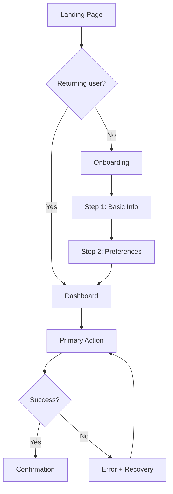

# UX Research & User Journey

## Mục đích

Hiểu sâu về người dùng trước khi thiết kế giao diện. Skill này đảm bảo mọi page, component, flow đều được thiết kế dựa trên user behavior thực tế, không phải assumption.

## Prerequisites

- `product-discovery` phải hoàn tất (có product brief và audience definition)

## Quy trình bắt buộc

### 1. Persona Development

Persona KHÔNG phải là mô tả nhân khẩu học hư cấu. Persona phải dựa trên behavior patterns.

```markdown
## Persona: [Tên đại diện]

### Context
- **Role/Nghề nghiệp**: [Vai trò]
- **Frequency of use**: [Lần đầu / thường xuyên / thỉnh thoảng]
- **Device & context**: [Desktop tại văn phòng / mobile đi đường / tablet ở nhà]
- **Tech savviness**: [Beginner / intermediate / advanced]
- **Time pressure**: [Có nhiều thời gian / vội vàng / bận rộn]

### Goals (Functional)
1. [Goal chính — hành động cụ thể muốn hoàn thành]
2. [Goal phụ]

### Goals (Emotional)
1. [Cảm xúc muốn đạt được. VD: "Tự tin khi trình bày"]
2. [Cảm xúc muốn tránh. VD: "Không bị overwhelm"]

### Pain Points
1. [Pain point 1 — mô tả cụ thể]
2. [Pain point 2]

### Triggers
- [Sự kiện/tình huống khiến họ tìm đến website]

### Decision Criteria
- [Tiêu chí họ dùng để đánh giá website/sản phẩm]

### Quotes (Đại diện cho mindset)
> "[Câu nói đại diện cho cách nghĩ của persona]"
```

### 2. User Journey Mapping

Cho MỖI persona, tạo journey map cho primary task:

```markdown
## Journey: [Tên task] — [Persona name]

| Phase | Action | Touchpoint | Thinking | Feeling | Pain Point | Opportunity |
|-------|--------|------------|----------|---------|------------|-------------|
| Awareness | [Hành động] | [Kênh/page] | [Suy nghĩ] | 😐😊😤 | [Vấn đề] | [Cơ hội cải thiện] |
| Consideration | [Hành động] | [Kênh/page] | [Suy nghĩ] | 😐😊😤 | [Vấn đề] | [Cơ hội] |
| Decision | [Hành động] | [Kênh/page] | [Suy nghĩ] | 😐😊😤 | [Vấn đề] | [Cơ hội] |
| Action | [Hành động] | [Kênh/page] | [Suy nghĩ] | 😐😊😤 | [Vấn đề] | [Cơ hội] |
| Retention | [Hành động] | [Kênh/page] | [Suy nghĩ] | 😐😊😤 | [Vấn đề] | [Cơ hội] |
```

### 3. Task Analysis

Mỗi primary task cần phân tích chi tiết:

```markdown
## Task: [Tên task]

### Task Overview
- **Trigger**: [Điều gì khiến user bắt đầu task?]
- **Goal**: [User muốn đạt được gì?]
- **Frequency**: [Bao lâu thực hiện 1 lần?]
- **Criticality**: [Thất bại thì sao? Hậu quả?]

### Happy Path (Steps)
1. [Step 1] → Page/component: [X]
2. [Step 2] → Page/component: [Y]
3. [Step 3] → Page/component: [Z]
4. [Completion] → Feedback: [Confirmation message]

### Alternative Paths
- Nếu [condition A] → [Path khác]
- Nếu [condition B] → [Path khác]

### Error Scenarios
| Error | Cause | Recovery | Message |
|-------|-------|----------|---------|
| [Lỗi gì] | [Nguyên nhân] | [Cách khắc phục] | [Thông báo cho user] |

### Edge Cases
- [Edge case 1: mô tả và cách xử lý]
- [Edge case 2: mô tả và cách xử lý]

### States
| State | Trigger | UI Behavior |
|-------|---------|-------------|
| Empty | No data yet | [Hiển thị gì] |
| Loading | Data fetching | [Skeleton/spinner/progressive] |
| Partial | Incomplete data | [Hiển thị gì] |
| Success | Task completed | [Confirmation, next action] |
| Error | Failed action | [Error message, retry option] |
| Offline | No connection | [Cached data / error state] |
```

### 4. Moments of Truth

Xác định các điểm quan trọng nhất trong journey:

```markdown
## Moments of Truth

### Zero Moment (ZMOT) — Trước khi đến website
- User tìm thấy website qua đâu?
- First impression cần truyền tải điều gì?

### First Moment (FMOT) — Vài giây đầu tiên
- Page nào user đến đầu tiên?
- Họ thấy gì above the fold?
- Value proposition có rõ ràng không?
- CTA có thể tìm thấy trong 3 giây không?

### Second Moment (SMOT) — Trải nghiệm sử dụng
- Task chính có hoàn thành smooth không?
- Có friction point nào không?
- Loading time có chấp nhận được không?

### Ultimate Moment (UMOT) — Sau khi sử dụng
- User có lý do quay lại không?
- Có sharing/referral mechanism không?
- Follow-up experience ra sao?
```

### 5. Priority Matrix

Sắp xếp tất cả findings vào priority matrix:

```markdown
## Priority Matrix

### 🔴 High Impact + Low Effort (Do First)
| Finding | Impact reason | Effort estimate |
|---------|--------------|-----------------|
| [Finding] | [Why high impact] | [Hours/days] |

### 🟡 High Impact + High Effort (Plan Next)
| Finding | Impact reason | Effort estimate |
|---------|--------------|-----------------|

### 🟢 Low Impact + Low Effort (Quick Wins)
| Finding | Impact reason | Effort estimate |
|---------|--------------|-----------------|

### ⚪ Low Impact + High Effort (Deprioritize)
| Finding | Why deprioritize |
|---------|-----------------|
```

### 6. User Flow Diagrams

Vẽ flow diagram cho mỗi primary task dùng Mermaid:



## Output bắt buộc

### `docs/ux-journey.md`
Tổng hợp:
- Personas (ít nhất 1 primary)
- Journey maps (ít nhất 1 per persona cho primary task)
- Task analysis (cho mỗi primary task)
- Moments of truth
- Priority matrix
- User flow diagrams

## Acceptance Criteria

- [ ] Ít nhất 1 persona dựa trên behavior (không phải demographics)
- [ ] Journey map cho primary task với pain points và opportunities
- [ ] Task analysis có happy path, error scenarios và edge cases
- [ ] Tất cả pages/components trong flow đều có 5 states (empty, loading, partial, success, error)
- [ ] Moments of truth được xác định
- [ ] Priority matrix có findings được phân loại
- [ ] Flow diagrams cho primary tasks

## Anti-patterns cần tránh

❌ Persona chỉ có tên, tuổi, nghề nghiệp mà không có behavior
❌ Journey map chỉ list steps mà không có thinking/feeling/pain points
❌ Chỉ design happy path, bỏ qua error và edge cases
❌ Không xác định states cho UI components
❌ Bỏ qua mobile/tablet context trong journey
❌ Tạo journey map nhưng implementation không reflect findings
